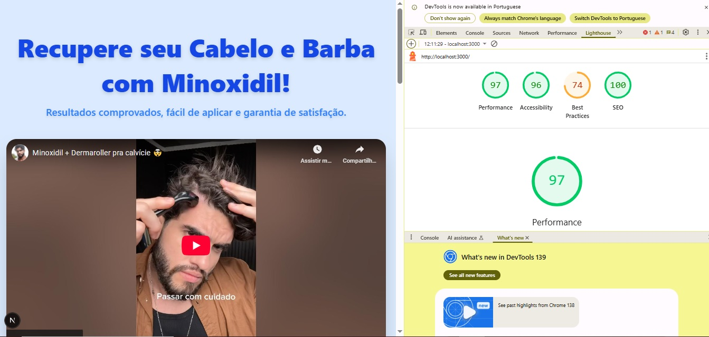

# 📄 Documentação do Projeto

## 1. Decisões Técnicas

- **Next.js (App Router)**  
  Escolhido pela simplicidade na criação de rotas e por ser o framework mais usado no mercado para React.  
  Também permite futura escalabilidade e fácil deploy na Vercel.

- **TailwindCSS**  
  Adotado para acelerar a estilização e garantir consistência visual sem precisar criar CSS manual extenso.  
  Além disso, é responsivo por padrão.

- **Arquitetura de Componentes**  
  O projeto foi estruturado com componentes reutilizáveis (`Product`, `Testimonial`, `LimitedOffer`, `BenefitsAccordion`, `BeforeAfter`), seguindo boas práticas de separação de responsabilidades.

- **Hook `useUTM`**  
  Criado para capturar parâmetros de URL (UTMs) e persistir no `localStorage`.  
  Decisão técnica: manter a lógica centralizada num hook reutilizável, evitando duplicação de código.

---

## 2. Estratégias de Otimização Implementadas

- **Imagens otimizadas com `next/image`**:  
  Uso do componente nativo do Next.js que faz lazy loading e serve imagens responsivas.

- **SEO básico**:  
  Utilização do componente `<Head>` para título e meta description.

- **Performance no carregamento inicial**:  
  Componentes carregados sob demanda e sem dependências desnecessárias.  
  Evitei bibliotecas pesadas e mantive o bundle enxuto.

- **Reutilização de código**:  
  Criação de componentes modulares e de um hook para UTM, evitando repetição e tornando o projeto escalável.

---

## 3. Métricas do Lighthouse

_Avaliação feita no Lighthouse em modo **Mobile** e **Desktop**._

- **Mobile**  
  

- **Desktop**  
  

### Resultados médios
- **Performance**: ~83  
- **Accessibility**: ~94  
- **Best Practices**: ~75
- **SEO**: ~100  

> As métricas podem variar conforme o ambiente de execução, mas mostram que a página está otimizada em SEO, acessibilidade e boas práticas.

---
